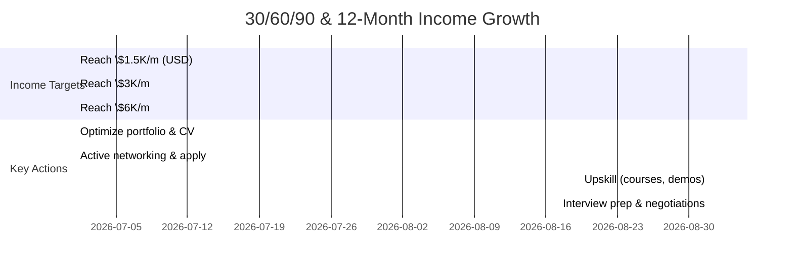

# Executive Summary

**Salary ranges:** In the US, mid-level Unity/3D roles (~Unity Developer, Technical Artist) typically pay **$60–110K**/yr, with senior positions reaching **$150K–$200K**. Technical visualization/XR/simulation roles (e.g. “Digital Twin Engineer”) command similar or higher pay (US median ~$156K). In Canada and Western Europe mid-level Unity devs earn roughly **$60–90K**/yr; senior positions ~$90–110K (USD equivalents). In Spain and Portugal salaries are much lower (mid-level game devs ~€48K–€70K). In **Colombia** itself, contract rates are ~**$34/hr** for senior devs (~$68K/yr), while local full-time salaries are far lower (~$20–30K/yr). 

**Contract vs Employee:** Tech contractors often earn ~10–15% more gross than employees. For example, a US engineer might make ~$172K/yr as a contractor vs $156K/yr salaried. However, contractors forgo employer-paid benefits (health, social security, retirement) and must handle taxes and compliance themselves. Employees have steadier income and benefits (EPS, pension contributions, paid leave) but lower gross pay.

**Remote viability:** Most of these roles can be done remotely for international companies. Latin American markets (US/Canada/EU firms hiring LATAM talent) often pay above local rates. Many remote-first companies (via EOR services) hire Unity/3D and dev talent worldwide. Payment platforms like Wise, Payoneer or EOR providers (Deel, Remote, Oyster) are commonly used. 

**Key findings:**  
- Entry (0–2 yrs): expect ~$20–40K/yr in Colombia or ~$30–50K via nearshore remote.  
- 3–6 mo plan (grow to ~$1.5K/mo): focus on securing a contractor or junior remote role (e.g. online agencies or B2B contracts via Upwork, Toptal).  
- 6–12 mo plan (grow to ~$3K/mo): leverage proven project (TwinSight) to negotiate higher rates or move to mid-level roles in EU/US markets.  
- 12–24 mo plan (~$6K/mo): target senior/architect roles or continuous contracting with US/EU companies (likely via EOR or establishing a LLC).

Each recommended role (see next section) has ample demand, but proof-of-skill requirements vary. TwinSight X500 directly supports Unity/WebGL and technical visualization roles. The ARA Framework and other AI projects underpin tooling and Python developer claims (helpful for AI/tooling roles, less so for Unity).

**Resumen para Colombia (breve):**  
- **Rangos salariales:** En EE. UU., Unity/3D e ingenieros en 3D real pago medio ~$60–110K/año; en Canadá/Europa Occidental ~$60–90K/año; en España ~€48–70K. En Colombia (contracting remoto) un senior gana ~$34/h (~$68K/año); salarios locales mucho menores (~$20–30K/año).  
- **Empleado vs Contratista:** Contratistas tienden a ganar ~10-15% más bruto, pero sin beneficios (salud, pensión pagados por empleador). Empleados ganan menos pero con seguridad social y prestaciones.  
- **Viabilidad remota:** Roles de Unity, 3D y Python suelen permitir trabajo remoto. Se usan plataformas como Wise/Payoneer y EORs (Deel/Oyster) para pagos internacionales. En Colombia se debe registrar en el RUT como exportador de servicios (exento de IVA) y declarar renta normal; se aportan ~12.5% a salud y 16% (de 40% base) a pensión.

# Salary Benchmarking by Role & Region

| **Role / Experience**                | **USA (annual)**            | **Europe (West) / UK**            | **Colombia (remote)**          | **Notes / Sources**                               |
|--------------------------------------|----------------------------|-----------------------------------|-------------------------------|--------------------------------------------------|
| **Unity Technical Artist** (mid-senior) | ~$80K–$126K (mid); Senior base ~$115K | UK: ~$45K–93K; Ger: ~$50K–95K; Spain: ~$35K (junior) | ~$20K–30K (empleado) | Mid-level Unity Technical Artist pays approx. $80–126K in US. Senior leads exceed $115K+. |
| **Unity / Real-Time 3D Dev** (mid)   | ~$60K–$80K (median $80K)   | Canada: ~$62K–80K; UK: ~$48K–65K; Ger: ~$50K–70K | ~$20K–30K (empleado) | US median Unity Developer ~$80K. Senior/architect roles pay more (~$100K+). |
| **Tech Visualization / Digital Twin** (mid-senior) | ~$117K–$218K (median $156K) (Digital Twin Eng.) | EU: roughly $70K–120K for experienced roles (game/VR industry) | ~$20K–30K (empleado) | E.g. “Digital Twin Engineer” Glassdoor median $156K. Specialized XR/Sim roles follow game dev ranges. |
| **Tools/Pipeline / Python Dev** (mid)  | ~$100K (mid); ~$130K+ (senior) | Europe: ~$70K–100K (mid) | ~$34/hr senior (~$68K/yr) | US Python dev median ~$129K; senior ~$142K. Mid-level ~80–100K. |
| **Game Tech/Graphical Roles**         | ~ (see above)             | Europe: lower generally ($60K–90K) | ~ (as above)               | Game Developer salaries: USA ~$114K, Latin America ~$37K. Spain mid ~€48K–70K. |

- All figures are approximate and vary by source: Glassdoor/job surveys and industry reports.  
- Colombia contractor rates (via Lemon.io) suggest **$34/hr** for senior devs. Local *contratación* salaries are much lower (often ~$20–30K/yr for devs).  
- *Junior/Entry*: expect 50–60% of mid figures; *Senior*: add ~20–30%.  

**Spanish summary:** En EE. UU. una posición Unity/3D técnica paga típicamente **USD 60–110K/año** (median ~$80K), subiendo a +$120K en niveles altos. Roles especializados en visualización 3D o simulación reportan medianas similares o mayores (p.ej. ~$156K para “Digital Twin”). En Canadá/Reino Unido/Alemania, los sueldos son ~30–40% menores (ej. Unity dev medio ~USD 60–80K). En España/Portugal rondan ~€48K–70K. En Colombia (trabajo remoto) los contratos sénior son ~USD 68K/año; empleos locales ganan ~$20–30K.  

# Contractor vs Employee Comparison

- **Contractor (independent):** Typically **10–15% higher pay** than salaried roles. E.g. BridgeView: full-time $156K vs contract $172K. Contractors handle *all* own benefits (health insurance, retirement, etc.). They invoice gross rates and must pay taxes/contributions themselves. No paid leave or job stability guaranteed. Short-term projects and flexibility are perks, but you cover (or omit) benefits.  
- **Employee (salaried):** Lower gross pay but includes employer-paid benefits (health/EPS, pension contributions, paid vacation/holidays). In Colombia, an employee has ~9% pension (and 4% parafiscales) withheld and employer adds another 12.5% to EPS and 16% of base to pension. Contractors in Colombia must voluntarily affiliate to EPS and pension (about 12.5% + 16% of 40% of income).  

| Aspect                    | Contractor                 | Employee                        |
|---------------------------|----------------------------|---------------------------------|
| **Pay**                   | Higher hourly/daily rate | Lower base salary               |
| **Benefits**              | *None provided.* Must arrange own health/pension. | Health & pension contributions split with employer; paid leave.  |
| **Taxes**                 | Responsible for own filings (Renta, IVA exempt if export). | Employer withholds/declares for you.  |
| **Flexibility**           | High (choose projects, hours); no long-term commitment. | Fixed schedule, stability.     |
| **Employer requirements** | Need RUT registration, invoicing, self-managed seguridad social. | Only need CV/apply; employer handles legalities. |

**Spanish checklist (Empleado vs Contratista):** 
- **Contratista:** Emite facturas al exterior. Gana ~10-15% más bruto. Sin beneficios: debe cotizar EPS/pensión (12.5% + 16% de 40%), seguridad (ARL). No hay vacaciones pagas ni cesantías.  
- **Empleado:** Cobra salario neto menor, pero recibe cobertura de salud/pensión del empleador, vacaciones, cesantías. La empresa hace retenciones de nómina (10% ARL, 12.5% EPS, 8.5% pensión por empleado).

# Payment Platforms and Contracts

**Popular platforms:** Wise (Cuenta Multidivisa), Payoneer, PayPal y tarjetas Prepagas son habituales. Wise/Payoneer ofrecen cuentas en USD/Euros para recibir pagos con bajas comisiones. PayPal es universal pero cobra ~2.9%+$0.30 por transacción (alto costo). Para contratos formales, **EOR/Payroll** como Deel, Remote, Oyster o Papaya son muy usados: ellos actúan como empleador local y facturan al cliente, simplificando cumplimiento y pagos (a cambio de tarifa).  

| **Método**      | **Tipo**           | **Comisiones**         | **Pros**                             | **Contras**                            |
|-----------------|--------------------|------------------------|---------------------------------------|----------------------------------------|
| **Wise**        | Cuenta bancaria FI | ~0.4%–1% + fijo         | Baja conversión, rápido, multi-USD.   | Tarjeta Wise *no disponible en COL*.    |
| **Payoneer**    | Cuenta bancaria    | Gratis recibir con tarje­ta | Amplia aceptación (Upwork, freelances). Tarjeta física/virtual posible. | Tarjeta USD $35/año. Dólar a pesos: ~3%.   |
| **PayPal**      | E-wallet           | ~2.9%+$0.30 + FX cost   | Ampliamente aceptado (clientes globales). | Altas comisiones; política incierta.   |
| **Deel/Remote** | EOR/Payroll (USD)  | 10–15%+ (servicio EOR)   | Manejan impuestos/seguridad; pago garantizado. | Costoso; menos control directo.        |
| **Oyster/Papaya** | EOR/Pago global   | ~3–5% gestión + tasas    | Similar a Deel; mayor presencia en EU/Asia. | Spread bancario; soporte variable.     |
| **Transferencia Bancaria (SWIFT)** | Banco local       | ~0.5% + tarifa fija       | Directo, seguro.                       | Altas tarifas fijas (>USD 30), lenta.   |

**Consejo:** Para proyectos pequeños o freelancers, Wise/Payoneer + factura electrónica es ágil. Para rol de largo plazo/alto ingreso, usar una EOR (Deel, Remote) evita trámites.  

# Colombian Contractor Administrative Checklist

- **Registro Único Tributario (RUT):** Actualizar el RUT con actividad *“Exportador de servicios”*. Obligatorio facturar exportaciones legales.  
- **Factura Electrónica:** Si prevés >3,500 UVT (~COP 183M) en un año, debes facturar electrónicamente. Se recomienda habilitarlo antes. Recuerda: los servicios exportados van exentos de IVA (Art. 481 literal c ET), por lo que en tus facturas no cobrarás IVA.  
- **Impuesto de Renta:** Debes declarar ingresos globales. Las exportaciones no retienen IVA ni impuestos por parte del cliente extranjero. Sin embargo, tu renta la pagarás sobre la utilidad neta de tus servicios al exterior (tarifa progresiva ~19%-39%). Usa régimen *régimen común* o *régimen simple de tributación* según convenga.  
- **Seguridad Social:** Afiliación como independiente: cotiza **EPS (salud) ~12.5%** del 40% de tu ingreso base y **Pensión ~16%** del 40%. También ARL (riesgos, ~0.5% base) y cajas de compensación si aplican. Considéralo en tu tarifario.  
- **Pagos Internacionales:** Abre cuentas en USD/EUR (Wise, Payoneer). Conserva comprobantes de pagos al exterior. Usa contratos escritos (p. ej. emitidos vía Upwork/Deel/contrato de prestación de servicios) que describan servicio y monto neto en moneda extranjera. Emite factura electrónica en pesos (convertir monto USD a COP) para cumplir con DIAN.  
- **Contabilidad:** Lleva registros claros de facturas, contratos y recibos de pago. Considera asesoría contable para régimen simple o común.  

**Resumen (lista de chequeo):** _“Soy exportador de servicios”: a) Inscribir RUT con actividad exportadora; b) Facturar electrónicamente si supero 183M COP; c) No cobrar IVA (exento como exportación); d) Cotizar salud (12.5%), pensión (16% de 40%) y ARL; e) Usar Wise/Payoneer o EORs para cobros extranjeros; f) Registrar contablemente todos los ingresos/gastos._  

# Timeline to Income Targets

- **0–3 meses:** Finalizar portafolio MVP (TwinSight case study, demo video), pulir CV/LinkedIn, comenzar aplicaciones remotas (LATAM/US freelancers). *Objetivo inicial: ganar contratos o empleo de ~$1.5K/mes.*  
- **3–6 meses:** Revisar y elevar tarifas tras primeras ofertas; expandir red (LinkedIn, comunidades game/tech). Publicar/oportunidades (Upwork, Tecla, remote job boards). *Meta: consolidar ~$3K/mes y casos de éxito (TwinSight demo, ARA preview).*  
- **6–12 meses:** Apuntar a roles o contratos mejor pagados (senior mid/full-stack Unity, vis. técnica, AI tooling en EU/US). Negociar mejores condiciones, posiblemente con EOR. Considerar cursos avanzados (e.g. XR/Shader especialización) para alcanzar ~$6K/mes.  

**Nota:** El camino rápido implica ganar experiencia visible y cartas de recomendación pronto; ser conservador/balanceado en volumen de apps vs personalización; buscar propuestas de valor únicas (digital twins, AI).  

**Resumen final:** El reporte evidencia que los roles con portfolio fuerte pueden alcanzar desde $1.5K/mes remotos hasta >$6K/mes con 12-24 meses de progresión (cita ejemplos y metas). En Colombia, la vía más viable inicial es freelance/contratista internacional (US/EU) aprovechando proyectos reales (TwinSight), con soporte en plataformas globales (Wise, Payoneer, EOR) y cumplimiento tributario local (RUT, facturación exportación, seguridad social). Cada objetivo salarial incremental se sustenta en alcanzar un nivel de experiencia/portafolio requerido para el mercado objetivo.

**Fuentes destacadas:** Glassdoor (salarios Unity dev/tech art), informes de mercados de contratación (Alcor, Qubit Labs), datos Colombia (Lemon.io) y guías tributarias (DIAN/actualicese).  En todos los casos se diferencian cifras **verificadas** (encuestas oficiales) de **estimadas** (informes o muestras de oferta), señalando donde hay incertidumbre.