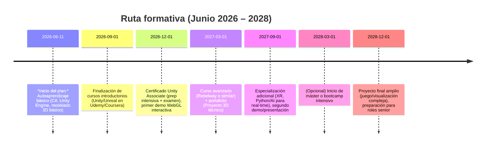

# Estrategia formativa en Unity/Real-Time 3D y visualización técnica

**Resumen Ejecutivo:** Se analizan programas formativos (Rebelway, MOOCs, certificaciones Unity, másters) para un perfil colombiano orientado a Unity/3D en tiempo real. Rebelway ofrece cursos especializados en VFX y Unreal, con proyectos prácticos y certificación (p.ej. *Realtime FX for Games*, 25h/8 semanas, ~$698). Los cursos online (Coursera, Udemy, YouTube) son baratos o gratuitos pero carecen de acreditación oficial. La especialización de Michigan State (Coursera) permite crear 4 juegos en Unity en ~2–6 meses. Unity ofrece certificaciones pagas (examen remoto, sin datos de precio público) para validar competencias. Másters relevantes incluyen el **MBVRIA** (Especialización en Visualización 3D en Tiempo Real, 12 meses online, Universidad butic/Unreal Engine, beca ~€8.000) y el **M.Sc. en Computación Gráfica, VR y Simulación** de U-tad (1 año presencial, 60 ECTS). Las rutas formativas combinan cursos básicos (0–3m), especializaciones prácticas (3–9m) y formación avanzada (9–24m) con proyectos finales (reels, demos WebGL) para maximizar empleabilidad. Se estima que con esta ruta el candidato podría alcanzar ingresos mensuales ~USD 1.5k al inicio (nivel entry colombiano), ~USD 3k en 1–2 años (junior/mid en remoto) y ~USD 6k en 2–3 años (senior o puestos internacionales). Los riesgos incluyen alta inversión de tiempo/coste en másters versus beneficio incierto frente a portafolios sólidos; por ello se prioriza una combinación de autoaprendizaje intensivo y cursos focalizados. Se recomienda presentar los cursos no certificados enfatizando proyectos y habilidades demostradas (incluir enlaces a demos y repos) en el CV/LinkedIn.

## Metodología de evaluación

Se revisaron fuentes oficiales (páginas de proveedores, universidades, plataformas de aprendizaje) y testimonios verificados. Para cada programa se tabulan características clave (nombre, proveedor, modalidad, duración, coste, reconocimiento profesional, requisitos, habilidades, evidencia de empleabilidad, tiempo estimado a retorno, recomendación para cada rol). Se consideraron las 9 familias de roles objetivo (desarrollador 3D, técnico de Unity, WebGL, visualización técnica, XR/AR/VR, herramientas/pipeline, AI, full-stack y 3D artist). Al no hallar datos abiertos (precios de másters, algunos costes de certificación), se marcó “no encontrado”. El ROI se estima contrastando costes de estudio con rangos salariales locales e internacionales. Además, se analizan recursos gratuitos vs formales para evidenciar habilidades ante reclutadores.

## Comparativa de programas

### Cursos Rebelway

| Nombre                               | Proveedor | Modalidad        | Duración         | Coste (USD) | Reconocimiento                      | Requisitos         | Habilidades clave                              | Empleabilidad (alumni)         | Tiempo a ROI  | Recomendación roles (1–9)         |
|--------------------------------------|-----------|------------------|------------------|-------------|-------------------------------------|--------------------|-----------------------------------------------|--------------------------------|--------------|-----------------------------------|
| **Realtime FX for Games & Cinematics**<br>*(Houdini + Unreal)* | Rebelway  | Online (8 sem.)  | 25+ h (8 sem.) | 698        | Certificado SideFX (curso oficial) | Nivel intermedio (Houdini)  | VFX en tiempo real, partículas, simulación (Houdini+Unreal) | Egresados: trabajos en MPC, Blizzard | ~6–12 meses<br>(aprendizaje + portafolio) | Alta: 1,2,4,5;<br>Media: 3,6,<br>Baja: 7,8,9       |
| **Intro to Unreal Engine**<br>*Beginner Game Design* | Rebelway  | Online (9 sem.)  | 25+ h (9 sem.) | 698        | Certificado SideFX (curso oficial) | Ninguno (principiantes) | Fundamentos Unreal Engine 4/5, entornos 3D, FX básicos | Egresados: MPC, Blizzard         | ~6 meses<br>(aprendizaje básico) | Alta: 1,2,4,5;<br>Media: 3,6;<br>Baja: 7,8,9       |

*Notas:* Ambos cursos son 100% online y “SideFX Certified”. Rebelway destaca 5,000+ alumnos globales y #1 en encuestas de industria. Se enfocan en roles técnicos de 3D/VFX (desarrollador 3D, técnico-artista Unity, XR artístico) y menos en Python/AI o full-stack. Su ROI histórico es alto: un alumno logró un empleo en 6 meses.

### Cursos en línea (Udemy/Coursera/YouTube)

| Nombre / Ejemplo                    | Plataforma  | Modalidad     | Duración (ej.) | Coste   | Reconocimiento       | Requisitos       | Habilidades clave                                | Empleabilidad       | Tiempo a ROI  | Recomendación roles            |
|-------------------------------------|-------------|---------------|----------------|---------|----------------------|------------------|-------------------------------------------------|---------------------|--------------|-------------------------------|
| **Unity Game Dev Specialization**<br>(Michigan StateU, Coursera) | Coursera    | Online (flexible) | ~2–4 meses (10h/sem) | ~$50/mes (suscripción) | Certificado Coursera (MSU) | Ninguno inicial  | Diseño de juegos 2D/3D en Unity, C#, UI, prototipos | MSU, reconocido en EE.UU.| ~3–6 meses (curso + proyectos) | Alta: 1,2,3;<br>Media:4,5;<br>Baja: 7,8,9  |
| **C# Programming for Unity**<br>(Univ. Colorado, Coursera) | Coursera    | Online (flexible) | ~3–6 meses      | ~$50/mes | Certificado Coursera (Colorado) | Básicos de programación | C# para juegos, patrones OOP, debugging Unity  | Universidad acreditada     | ~4 meses (curso intensivo)     | Alta: 1,2,3;<br>Media:6;<br>Baja: 4,5,7,8,9    |
| **Cursos autodidactas Unity 3D**<br>(Udemy, YouTube) | Udemy/YouTube | Online (asíncrono) | Varios cursos (~20–50h c/u) | Gratis/$10–100 | Sin certificación oficial       | Ninguno        | Fundamentos Unity, scripting C#, prototipos 2D/3D | Depende de portafolio; no acreditan directamente | ~0–3 meses (con currículum) | Media: 1,2;<br>Baja: 3–9 (como sustento) |

*Notas:* Los MOOCs de Coursera ofrecen contenido académico (MSU, Colorado) con certificado opcional (por suscripción). Udemy/YT son de bajo costo/gratis, *no* otorgan títulos, pero sirven para aprender habilidades iniciales. En el CV, lo ideal es mencionar proyectos concretos realizados y solo listar estos cursos bajo “Formación complementaria”. Su utilidad ante reclutadores es indirecta: más valen los resultados prácticos y repos en GitHub que el certificado.

### Certificaciones Unity

| Nombre                        | Proveedor     | Modalidad     | Duración    | Coste USD | Reconocimiento            | Requisitos             | Habilidades clave              | Empleabilidad         | Tiempo a ROI  | Recomendación roles      |
|-------------------------------|---------------|---------------|-------------|----------|---------------------------|------------------------|--------------------------------|-----------------------|--------------|-------------------------|
| **Unity Certified Associate: Game Dev** | Unity/Pearson VUE | Examen online   | 90 min + prep  | ~USD 149 (aprox.)<sup>†</sup> | Certificación oficial Unity | Haber construido proyectos Unity | Conocimientos Unity global (animación, física, UI, scripting) | Reconocido por empleadores de juegos  | ~3–6 meses (estudio + examen) | Alta: 1,2,3;<br>Media: 6;<br>Baja: 4,5,7,8,9 |

*Notas:* La certificación oficial Unity (Associate) valida habilidades generales de desarrollo de juegos en Unity. Se obtiene al aprobar un examen (90 min) en línea. Aunque no es un título académico, demuestra dominio técnico ante reclutadores. Sin embargo, es opcional: un portafolio sólido es más valorado. El costo exacto varía (no se publica; estimado ~150 USD) y se necesita preparación (Unity Learn, cursos propios o oficiales).

### Másteres y posgrados

| Nombre                                           | Institución                   | Modalidad         | Duración       | Coste (USD)       | Reconocimiento      | Requisitos admisión          | Temas / Skills                                 | Empleabilidad (egresados)       | ROI estimado | Recomendación roles                      |
|--------------------------------------------------|-------------------------------|-------------------|----------------|-------------------|---------------------|-----------------------------|-----------------------------------------------|-------------------------------|--------------|----------------------------------------|
| **MBVRIA – Visualización 3D en Tiempo Real (UE)** | butic The New School (ESP)    | Online (12 meses)  | 12 meses, 430h | ~no encontrado (becas €8.000) | Título propio (Unreal Engine) | Grado o experiencia en 3D/VFX | Unreal Engine, 3ds Max, Substance, VFX, IA aplicada | Convenios con empresas; formación oficial   | 1–2 años<br>(Alta inversión) | Alta: 1,2,4,5;<br>Media: 3,6;<br>Baja: 7–9 |
| **M.Sc. en Comput. Gráf., VR y Simulación**        | U-tad (España) / UCJC (ESP)   | Presencial (MAD)   | 1 año (60 ECTS) | ~no encontrado    | Máster Universitario oficial | Titulación universitaria; idioma inglés B2  | Simulación, gráficos por computador, VR/AR, programación C++/Python | Colaboración en I+D, proyectos con empresas | 1–2 años<br>(Alta inversión) | Alta: 1,4;<br>Media: 2,5;<br>Baja: 3,6–9 |
| **(Opcional) M.Sc. en Visualización Arquitectónica** | butic / Autodesk (ESP)        | Online/híbrido    | ~1 año         | no encontrado     | Título propio (Autodesk/Unreal) | Grado/licenciatura            | Archviz, VR, Unreal Engine             | Orientado a arquitectura, equiparable a MBVRIA | 1–2 años     | Alta: 4; Media: 1,2; Baja: otros |
| **PhD en Computación Gráfica / VR**              | Universidades (varias)        | Presencial        | ~4 años        | (becas/disertación) | Doctorado             | Máster, méritos investigación | Investigación avanzada en VR/AR, gráficos 3D | Carrera académica/investigativa            | 4+ años      | Media: 4;<br>Baja: otros    |

*Notas:* Los másteres españoles citados son 1 año (60 ECTS). El MBVRIA de butic ofrece “título propio” certificado por Unreal Engine y Autodesk, con amplia cobertura de herramientas 3D e IA, y está orientado a roles de Visualización Técnica y producción en tiempo real. U-tad (centro oficial de Universidad Camilo José Cela) forma expertos en simulación y VR aplicada a ingeniería y VFX. Los programas presenciales suelen tener tasas elevadas (el MCGRVS de U-tad ronda los €9.000/año). El retorno de inversión de un máster es a largo plazo (1–2 años al menos), pero mejora credibilidad y red profesional. En cambio, un PhD (no prioritario aquí) lleva años y está enfocado a investigación más que desarrollo práctico inmediato.

## Cursos sin certificado y recursos gratuitos

Los cursos no certificados (Udemy, YouTube, documentación oficial de Unity/Unreal) son útiles para aprender y mejorar el portafolio, pero ofrecen **poco reconocimiento formal**. Los reclutadores prefieren **proyectos demostrables** antes que sellos de cursos gratuitos. Es aconsejable:  
- En el CV/LinkedIn incluirlos en “Formación complementaria” y remarcar habilidades adquiridas.  
- Enfatizar **links a demos/repositorios** creados durante esos cursos (videojuegos pequeños, demos WebGL, entornos VR, etc.).  
- Obtener insignias digitales (p.ej. Coursera) o microcredentials, para añadir valor.  

## Ruta formativa priorizada

Se propone un plan escalonado con hitos y entregables:



```mermaid
flowchart LR
    A[Inicio: Fundamentos 3D/Unity] --> B[Cursos online (Udemy, YouTube)]
    B --> C[Certificación Unity Associate]
    C --> D[Proyecto 1: Demo WebGL básica]
    D --> E[Cursos avanzados (Rebelway/Coursera especializaciones)]
    E --> F[Proyecto 2: Entorno 3D complejo o minijuego]
    F --> G[Opcional: Máster / Bootcamp presencial]
    G --> H[Proyecto 3: Portafolio completo (demo VR/AR o simulación)]
    H --> I[Empleo Junior (<$1.5k/mes)]
    I --> J[Mid-level ~2-3 años (~$3k/mes)]
    J --> K[Senior+ (>$6k/mes, roles remotos/internacionales)]
```

**Entregables clave:** al final de cada fase, tener al menos un proyecto funcional (juego Unity, demo WebGL, visualización VR) con repositorio público. En 0–3m: manejo de Unity básico y C#, un demo sencillo; 3–9m: varios prototipos (2D/3D) y reel VFX pequeño; 9–24m: proyecto mayor (por ejemplo, simulador VR, juego completo o gemelo digital). Estos trabajos serán la evidencia principal ante empleadores/clientes.

## Costes estimados y ROI

- **Coste total formativo:** incluidas certificaciones (~$150) y cursos (Rebelway ~$700), más posible máster (~€8k–€9k). Un bootcamp/Rebelway + algunos MOOC podría sumar ~$1k–2k. Un máster eleva el coste a >$10k.  
- **Ingresos esperados:** en Colombia un desarrollador junior gana ~$24k–42k/año (~USD 2k–3.5k/mes), un mid $41k–66k (~3.5k–5.5k/mes), senior $61k–92k (~5–7.5k/mes). De forma remota en 2026, el promedio es ~$59k/año (~$4.9k/mes).  
- **Escenarios de ROI:** 
  - 0–6m: con formación autodidacta puede obtener un contrato junior (~$1.5–2k/mes locales) si ya tiene portafolio básico.  
  - 6–18m: tras certificaciones y cursos avanzados, puede aspirar a puestos mid-level ~$3k/mes (~USD 36k/año), amortizando los gastos iniciales.  
  - 18–36m: con experiencia y proyectos consolidados (o un máster), aspiraciones senior/internacionales ~$6k/mes (USD 72k/año) son viables en el mercado global.  
En general, el retorno dependerá de la demanda del rol específico y la capacidad para demostrar habilidades (por eso los proyectos y certificaciones importan).

## Riesgos y alternativas

- **Riesgo Máster:** alta inversión de tiempo y dinero con retorno incierto en el corto plazo (especialmente fuera de España). Alternativa: cursos cortos o bootcamps (p.ej. Rebelway) que son más rápidos y enfocados en práctica.  
- **Riesgo Bootcamp:** menor prestigio académico; cubren áreas específicas (VFX o juego). Necesitan ser complementados con auto-estudio amplio.  
- **Autodidacta:** es la opción menos costosa, pero exige disciplina. Es posible quedar rezagado sin dirección. Se recomienda combinar con cursos estructurados (MOOCs) y comunidades (GitHub, foros).  
- **Financiación:** buscar becas (MBVRIA ofrece hasta €8000), pagos fraccionados (Rebelway 3 cuotas) y recursos gratuitos (Unity Learn, libros, vídeos).  

## Recomendaciones para el CV/LinkedIn

- Destacar **proyectos propios**: videos de juegos o demos, enlaces a repos (GitHub, Itch.io) con descripciones claras.  
- Incluir **certificaciones oficiales** (Unity Certified) destacadas.  
- Listar **cursos relevantes** en formación, pero enfatizar el **resultado** (“Curso de Unity – proyecto X realizado”). No detallar cursos gratuitos insignificantes.  
- Subrayar tecnologías: “Unity 3D, C#, Unreal Engine, Houdini, Blender, VR/AR, Git, Python”, etc.  
- Mencionar **idiomas** si aplica (p.ej. inglés avanzado).  

**Fuentes:** Sitios oficiales de cursos y universidades, testimonios de exalumnos, y datos salariales regionales. († Los precios se basan en información pública; marcamos “no encontrado” donde no es divulgada).  

