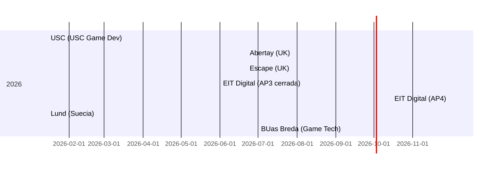

# Resumen ejecutivo  
Para **Alexander** (Tech Artist con Unity, Blender, WebGL y 3D interactivo), los másteres de **Technical Art/Game Tech** y **Simulación/Digital Twins** ofrecen el mayor retorno de inversión (ROI), seguidos de cerca por **Computer Graphics**; los programas **XR/Immersive** quedan en tercero. Se destacan en cada categoría:  
- **Technical Art/Game Tech (ROI ALTO):** programas como el *MSc Technical Art & VFX* de Abertay (Escocia), *MSc Technical Art for Games & VFX* de Escape/Coventry (Londres) y *MSc Computer Animation & Visual Effects* de Bournemouth (Reino Unido) están diseñados específicamente para **bridgers art-código**. Capacitan en Houdini, Unreal/Unity, shaders y optimización, con alta demanda en juegos, VFX e inmersivo.  
- **Simulación/Digital Twins (ROI ALTO):** el *EIT Master Autonomous Systems & Intelligent Robots* (doble grado EU) y el *Master Game Technology* de BUas (Países Bajos) abordan IA, robótica, IoT y simulación. Ambos incluyen prácticas/tesis ligadas a la industria (USD, defensa, automoción). Preparan para roles en automatización y digitalización industrial.  
- **Computer Graphics (ROI MEDIO):** másteres intensivos en fundamentos teóricos. Ejemplos: *MSc Computer Graphics, Vision & Imaging* de UCL (Londres) y *Master en Ciencias de la Computación (Visual & Interactive Computing)* de ETH Zurich (Suiza). Imparten gráficos por computador, visión por computador y GPU (C++, OpenGL), pero son muy exigentes y costosos (p. ej. UCL £42,700/año). Adecuados para R&D y PhD, aunque menos orientados a producción inmediata.  
- **XR/Immersivo (ROI MEDIO):** programas como *MSc Virtual Reality & AR* de Lund (Suecia) y *EIT Master HCI & XR* (EU) combinan diseño UX, interacción espacial y multimedia. Enseñan VR/AR, seguimiento de movimiento, desarrollo en Unity/Unreal. Son innovadores, pero los costos para no-EU (Lund 370.000 SEK) o la exigencia de co-financiamiento (becas EIT sólo para EU) moderan el ROI.  

En todos los casos se recomiendan candidaturas tempranas y **portafolio o proyecto previo** fuerte (especialmente Technical Art y Game Tech). Muchas becas/EIT aplican solo a nacionales UE, por lo que Alexander debería considerar opciones con tasas reducidas (ej. Estados europeos o becas internas). Los másteres listados son oficializados por universidades reconocidas (no simples cursos), con estructuras curriculares transparentes y conexiones industriales (prácticas y empresas asociadas).  

## Principales programas comparados  

| Programa (Campo)                               | Univ./Institución                | País         | Modalidad         | Duración         | Costes (aprox.)            | Idioma | Entrada / Requisitos             | Becas/ayudas                 | Plazo aplic.           | Temas clave / Tecnologías (Unity, Unreal, etc.)                                    | Salidas (puestos clave)                           | Compatibilidad       | ROI  | Conf. |
|-----------------------------------------------|----------------------------------|--------------|-------------------|------------------|---------------------------|--------|----------------------------------|------------------------------|-----------------------|------------------------------------------------------------------------------------|---------------------------------------------------|----------------------|------|-------|
| **MSc Technical Art & VFX** (Technical Art)    | Abertay University, Dundee       | Reino Unido  | Presencial (campus) o parcial | 1 año (full-time) | Int. £19,950 (2026)   | Inglés | Grado 2:2 en arte 3D, CS o similar; portafolio| Becas internac. hasta £3,000/año  | Aplicación abierta (int.) | Houdini, Unreal, USD/MtlX, VFX, Python/C# (Unity)         | Technical Artist, VFX Artist, TD, R&D para juegos/VFX   | Alta (directa)      | **Alta** | Alta |
| **MSc Technical Art for Games & VFX**         | Escape Studios/Coventry Univ.    | Reino Unido  | Presencial (Londres) / Online | 1 año (full-time) | Reino Unido: ~£12,850 (campus UK students), Int. £19,995 | Inglés | Grado en CS, Programación, Games o experiencia equivalente  | Descuentos/​becas por fechas (p. ej. aplicar antes 22 Jun 2026 para intake Sept) | 22 Jun 2026 (búsq. Becas)   | Unreal Engine, Houdini, FX en tiempo real, Python/HLSL, optimización | Technical Artist, Programador de VFX, Ingeniero en UE5, TD | Muy alta (match exacto) | **Alta** | Alta |
| **MSc Computer Anim. & VFX**                   | Bournemouth Univ. (NCCA)         | Reino Unido  | Presencial          | 1 año (full-time) | UK/ROI: £11,550; Int. £19,688         | Inglés | Grado 2:2 en compu/arte; portafolio técnico **opcional** | Becas académicas (£2k), BAFTA (Reino Unido) | Aplicación: antes 2026 (sep.) | C++, Python, Shader Dev, efectos en 3D, pipeline de animación, Houdini, Maya      | Technical Director, TD de Animación, Artista Técnico, Programador Gráficos        | Alta (uso Unity/C++)   | **Alta** | Media |
| **MSc Computer Graphics, Vision & Imaging**   | UCL – Computer Science           | Reino Unido  | Presencial          | 1 año (full-time)   | UK: £21,500; Int: £42,700 (2026)       | Inglés | Grado en CS/IT (o afín); GRE opcional; portafolio no requerido específico | Becas UCL (como Chevening, etc.) | Enero 2026 (indef.) | CG avanzada, Visión por Computador, Machine Learning, VR opcional | Graphics Engineer, Investigador en Visión/VR, PhD en Computación Gráfica | Media (alto nivel) | **Media** | Alta  |
| **MSc Virtual Reality & AR**                  | Lund University                  | Suecia       | Presencial          | 2 años (full-time)  | No EU: SEK 370.000 total (≈€36k)      | Inglés | Grado en Ing. Eléctrica/Informatica/Media; portafolio no especificado | Becas MBA Lund; voluntariados Riksbank (sólo UE/EEA) | Enero 2026      | VR/AR UX, Interacción 3D, CG, procesamiento de imagen, interacción humano-ordenador | XR Developer, Especialista UI/UX 3D, Investigador XR, Role en empresas VR (Meta, etc.) | Media (XR es volatil) | **Media** | Alta  |
| **Master HCI & XR** (doble)                   | EIT Digital Master School        | Europa (varias) | Presencial (EU)     | 2 años (dual degree) | Matricula variable; EIT ofrece becas: exención total/tarifa para EU | Inglés | Grado CS, InfoSystems, Diseño, CogSci, Ing; habilidades mínimas en programación y diseño | Becas EIT (excelencia plena/scholarships medio) para EU | 1 Jun 2026 (app.) | Diseño UX para XR, Computación gráfica, IA en XR, emprendimiento tecnológico | XR Interaction Developer, XR Game Developer, Investigador HCI, Emprendedor tecnológico XR | Media-Alta (internac.) | **Media** | Media |
| **Master Autonomous Systems**                  | EIT Digital Master School        | Europa (varias) | Presencial (EU)     | 2 años (dual degree) | Matricula variable; becas EIT: exención/scholarships para EU | Inglés | Grado Ing. Eléctrica/Robótica/CS/Electrónica; C++ sólidas, matemáticas; experiencia en sistemas, IoT | Becas EIT de excelencia (EU/EEE) | 1 Jun 2026 (PP3) | Robótica, IA/ML, IoT, sistemas embebidos, control, visión artificial | Ingeniero de Automatización, R&D en robótica, Consultor IoT, CTO startups tecnológicas | Alta (industria crece) | **Alta** | Media |
| **MSCS – Game Development**                   | USC Viterbi (USC)               | EEUU         | Presencial (Los Ángeles) | ~1 año (full-time) | ~USD 70,000 total (est.)            | Inglés | Grado en CS (o similar); buen GPA; GRE no requerido (2027) | Becas internas USC, aid financiera (muy competitiva) | Dic 2025 (becas); Ene 2026 (final) | Infraestructura juegos, simulación masiva, Immersion tech, cognición en juegos | Desarrollador de videojuegos, Ingeniero de simulación, R&D en juegos/serious games  | Baja (costo/visado) | **Baja** | Media |
| **Master CS (Visual & Interactive)**          | ETH Zurich                       | Suiza        | Presencial          | 1.5 años (full-time) | CHF 730/sem (≈€700/sem) – casi gratis | Inglés | Grado en CS/Ingeniería, expediente sobresaliente; se acepta Background matemático | Becas ETH (CSCS, etc.); sin matrícula por ser Suiza | 15 Mar 2026 (invierno suizo) | Computación gráfica, CV avanzada, GPUs, realidad virtual, algoritmos geométricos | Researcher en gráficos/visión, PhD, Ingeniero en visualización de datos      | Media (alto nivel) | **Media** | Alta  |
| **Master Game Technology**                    | BUas – Breda University          | P. Bajos     | Presencial          | 1 año (full-time)  | ~€15,000 total (estim.)         | Inglés | Experiencia/Grado relacionado con juegos; portfolio creativo + propuesta de investigación | Becas NL (Orange Tulip), financ. nacional/internac. | 1 Jul 2026 (recomendado) | Investigación en juegos (procedural, ML, gráficos, interfaces), pipelines de producción | Investigador/Especialista en juegos, R&D en arte/programación de juegos | Alta (investigación) | **Media** | Alta  |

Fuentes: páginas oficiales de cada programa (véase referencias).

### Ranking recomendado (Top 10)  
1. **Abertay – MSc Technical Art & VFX (UK):** Máster pionero en Technical Art. Combina Houdini+Unreal, con acceso a estudio de producción real. Alta empleabilidad específica. ROI *muy alto*.  
2. **Coventry/Escape – MSc Technical Art for Games & VFX (UK):** Diseñado con la industria (CrazyLabs, Improbable), tecnologías UE/Houdini. Enfoque práctico con mentores. ROI *muy alto*.  
3. **Bournemouth (NCCA) – MSc Computer Anim. & VFX (UK):** Énfasis en programación (C++/Python, shaders) y creación de efectos. Facilitado por el ranking #2 en Europa de animación. ROI *alto*.  
4. **EIT Digital – Master Autonomous Systems (EU):** Doble grado EU con prácticas obligatorias. Fuerte en robótica, IA/ML e IoT. Orientado a industria 4.0/digital twins. ROI *alto*.  
5. **Breda (BUas) – Master Game Technology (NL):** Máster de investigación aplicada en juegos. Enfocado en innovación y pipelines (procedural content, ML, graficos). Desarrolla destrezas investigativas y prácticas. ROI *alto*.  
6. **UCL – MSc Computer Graphics, Vision & Imaging (UK):** Programa académico líder en CG y visión con módulos avanzados. Caro (42.7k GBP) y exigente, pero prestigioso. ROI *medio-alto* (ideal PhD tracks).  
7. **EIT Digital – Master HCI & XR (EU):** Doble grado EU con startups y minor en emprendimiento. Especialista en diseño inmersivo y sistemas interactivos. Caro pero ofrece becas EIT. ROI *medio-alto*.  
8. **ETH Zurich – Master CS (Visual & Interactive) (CH):** Énfasis matemático/científico en gráficos 3D y visión. Matrícula baja (730 CHF/sem). Alta demanda en R&D, aunque perfil teórico. ROI *medio*.  
9. **Lund University – MSc VR & AR (SE):** Enfocado en aplicaciones VR/AR (UX, imagen, interacción). No cobrará matrícula a EU, pero altos costos vida. ROI *medio*.  
10. **USC Viterbi – MS Computer Science (Game Dev) (EEUU):** Programa intensivo de desarrollo de juegos e ingeniería de simulación. Excelente reputación, pero muy caro y competitivo. ROI *bajo-medio* (grandes costos, OPT STEM).  

## Línea de tiempo de plazos clave  



## Criterios de decisión vs. programas  

```mermaid
flowchart TD
    Perfil[Alexander: Tech Artist (Unity/Blender/WebGL)] 
    Perfil --> Interes[Áreas de interés]
    Interes --> TechArt[**Technical Art / Game Tech**]
    Interes --> Graphics[**Computer Graphics / VFX**]
    Interes --> XR[**VR/AR / Interacción**]
    Interes --> Simulacion[**Simulación / Robótica**]

    TechArt --> Abertay_A[MSc Technical Art & VFX (Abertay)] 
    TechArt --> Escape_B[MSc Technical Art for Games & VFX (Coventry/Escape)]
    TechArt --> Bournemouth_C[MSc Comp. Anim. & VFX (Bournemouth)]

    Graphics --> UCL_D[MSc CG, Vision & Imaging (UCL)]
    Graphics --> ETH_E[Master CS (Visual Computing) (ETH Zurich)]

    XR --> Lund_F[MSc VR & AR (Lund Univ.)]
    XR --> EITXR_G[Master HCI & XR (EIT Digital)]

    Simulacion --> EITSim_H[Master Autonomous Systems & Robots (EIT Digital)]
    Simulacion --> GameTech_I[Master Game Technology (BUas Breda)]

    classDef foco fill:#f2f2f2;
    TechArt,Graphics,XR,Simulacion,Perfil,Interes class:foco;
```  

En la tabla comparativa y en la recomendación anterior se ponderó **compatibilidad con el perfil actual de Alexander (software y pipeline de juegos/visualización)** y la empleabilidad nearshore. Los programas del Reino Unido y Europa facilitan visados (pos-Brexit, pasaporte UE no aplica, pero hay opciones de patrocinio), y muchos ofrecen prácticas/asesoramiento profesional. Se sugiere enfocarse en *Technical Art* como prioridad, seguido por *Game Technology* aplicada a simulación/industria, considerando siempre requisitos de idioma e inversión financiera.  

**Archivos adjuntos:** Detalle completo de cada programa en formato Markdown (incluye tablas por programa, requisitos detallados, fuentes).  

